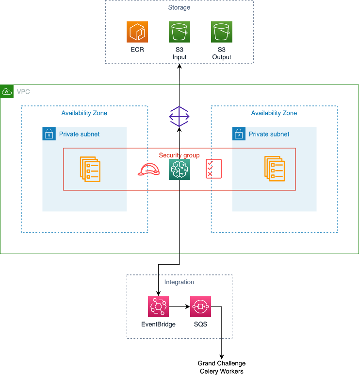

# AWS Grand Challenge Components

This module creates the AWS resources for the components runtime environment for Grand Challenge.
This integrates with the components module of the [Grand Challenge Django Backend](https://github.com/comic/grand-challenge.org).

## Open Tofu

This module is available in the [Open Tofu Registry](https://search.opentofu.org/module/diagnijmegen/grand-challenge-components/aws/latest).

## Architecture

Around 50 resources are created, the diagram below shows some of the main features created by this module.

## Costs

Please note that **many of the resources launched by this module are not covered by the AWS free tier**.

| Usage Type | Costs            |
|---|------------------|
|GPU inference | ~$0.8-1.6 / hour |

## Usage

### AWS Account Preparation

AWS set service limits which can prevent the use of this module, especially for new accounts.
You will need to make several requests to AWS support to increase these limits, and the wait time can be 2 to 4 weeks.

1. Decide on the region where you would like to deploy.
   Based on experience we recommended `us-east-1`, `us-west-2`, or `eu-west-1` due to GPU availability there.
   Note down this desired region as all of the following service requests will need to be done there.
1. If you would like to have GPU inference:
   - Go to the [ml.g4dn.xlarge for training job usage](https://console.aws.amazon.com/servicequotas/home/services/sagemaker/quotas/L-3F53BF0F).
   - Select your desired region in the top right **region drop down**.
   - Click on `Request quote increase`.
   - Determine the Quota value that you would like to request.
   This controls how many parallel SageMaker Training Jobs you run using `ml.g4dn.xlarge` instances (Nvidia T4 + 16GB memory).
   - AWS Support will contact you and likely ask details about your use case, and that you understand the billing consequences of this request.
     - The instances will auto-scale on demand, and scales to 0 when not in use.
     However, if you have GPU tasks that are contsantly running this will cost around $600 + Tax / GPU instance / month for a `ml.g4dn.xlarge` instance.
   - Repeat this step for any other instance types you would like to use.
1. Repeat the previous step for `ml.g4dn.2xlarge`, `ml.g5.xlarge` and `ml.g5.2xlarge` instances

Once all of your AWS Support requests are resolved you can move on to using this module.

### Deploying this Solution

1. Ensure that `terraform` is installed on the machine that you are deploying from
1. Create a new directory
1. Create `main.tf` and populate it from one of the [example configurations](./examples)
1. Edit the values in `main.tf` to match your desired configuration
1. Run `terraform init`
1. (If necessary) log in to the aws cli with the profile named in `main.tf`
1. Run `terraform apply`

This will automatically generate around 50 resources, and will take around 10 minutes from scratch.

### Destroying the infrastructure

1. Run `terraform destroy` to destroy all resources for your module.
1. Note that S3 buckets can only be deleted if they are empty. To empty them, go to [Amazon S3](https://console.aws.amazon.com/s3/home), select each bucket individually and click on `Empty`. The `logs` bucket will need to be emptied roughly half-way through the destroy process, the rest can be emptied before running `terraform destroy`.
